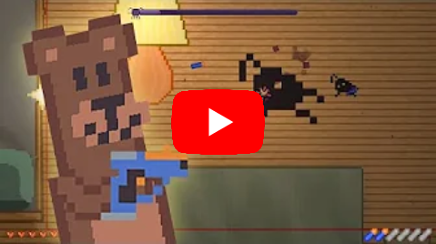

# WatchBear

A singleplayer objective defense game built using Unity.

```
A game where you play as a teddy bear, protecting the child while he is sleeping from scary shadow spider monsters. 

You use a nerf gun to shoot down the scary spiders, but you have a limited supply of ammo, you'll have to make do of what you have, pick up used bullets to replenish your nerf gun magazine to keep fighting. 

You can heal by walking into cozy sparks, will you protect the child until the end, or will you die trying?
``` 

## Gameplay Video

[](https://www.youtube.com/watch?v=l-NoXdTXvfA)

## How to get started
1. Install Unity 6000.3.4f1
2. Open the project
3. Enjoy!

## Development Team
A list of people who participated in the game's development during the Winter Melonjam 2022
- Swiftkraft - Team Leader, Lead Programmer
- Polybro (Wiktor Czernik) - Programmer & 2D Artist
- Kaczorski - 2D Artist
- Trish - Composer & Sound designer